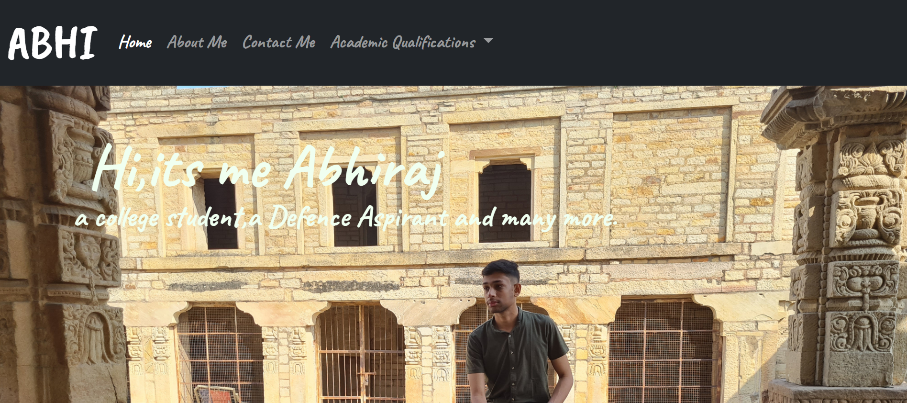

# My Portfolio



## Description

A personal portfolio website to showcase projects, skills, and experiences. This repository contains the code for a responsive and interactive portfolio built using HTML, CSS, and JavaScript. The portfolio is designed to provide a comprehensive overview of professional accomplishments, projects, and skills.

## Features

- **Responsive Design:** Optimized for various screen sizes and devices.
- **Interactive Elements:** Smooth transitions and animations for a modern look.
- **Projects Section:** Showcase completed projects with descriptions, technologies used, and links to live demos or repositories.
- **Skills Section:** Highlight key skills and expertise.
- **About Section:** Provide a brief introduction and background information.
- **Contact Form:** Allow visitors to get in touch directly through the website.

## Technologies Used

- HTML5
- CSS3
- JavaScript

## Getting Started

Follow these instructions to get a copy of the project up and running on your local machine for development and testing purposes.

### Prerequisites

Ensure you have the following installed on your local machine:

- A modern web browser (e.g., Chrome, Firefox, Edge)
- Git (optional, for cloning the repository)

### Installation

1. **Clone the repository:**
   ```bash
   git clone https://github.com/Abhirajtiwari1/oasis-portfolio.git

2. **Navigate to the project directory**
   ```bash
    cd portfolio

3. **Index File**
   ```bash
     open portfolio.html

### Demonstration To Project:
    ```bash
       https://www.linkedin.com/posts/abhiraj-tiwari-233699252_connections-css-javascript-activity-7075691831564410880-A8sc?utm_source=share&utm_medium=member_desktop
   
    
